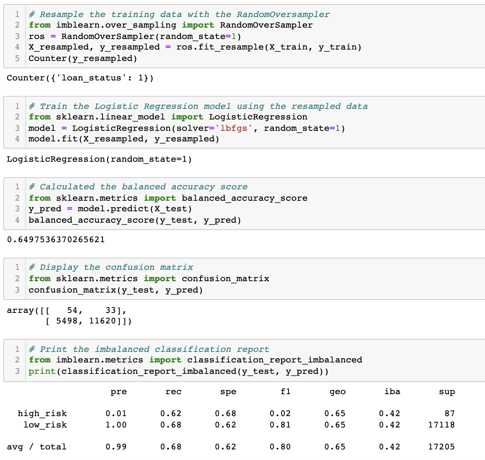
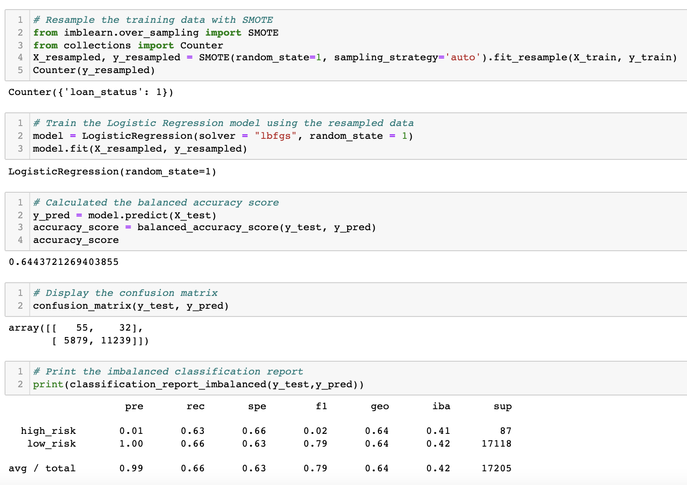
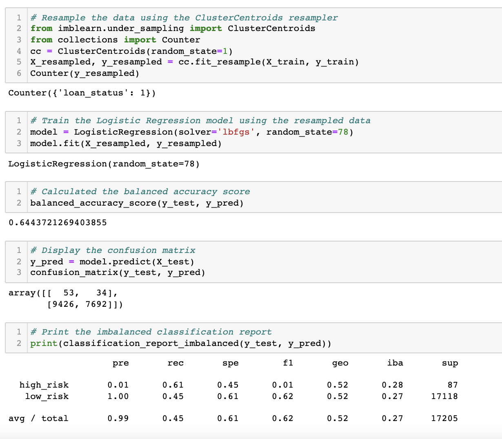
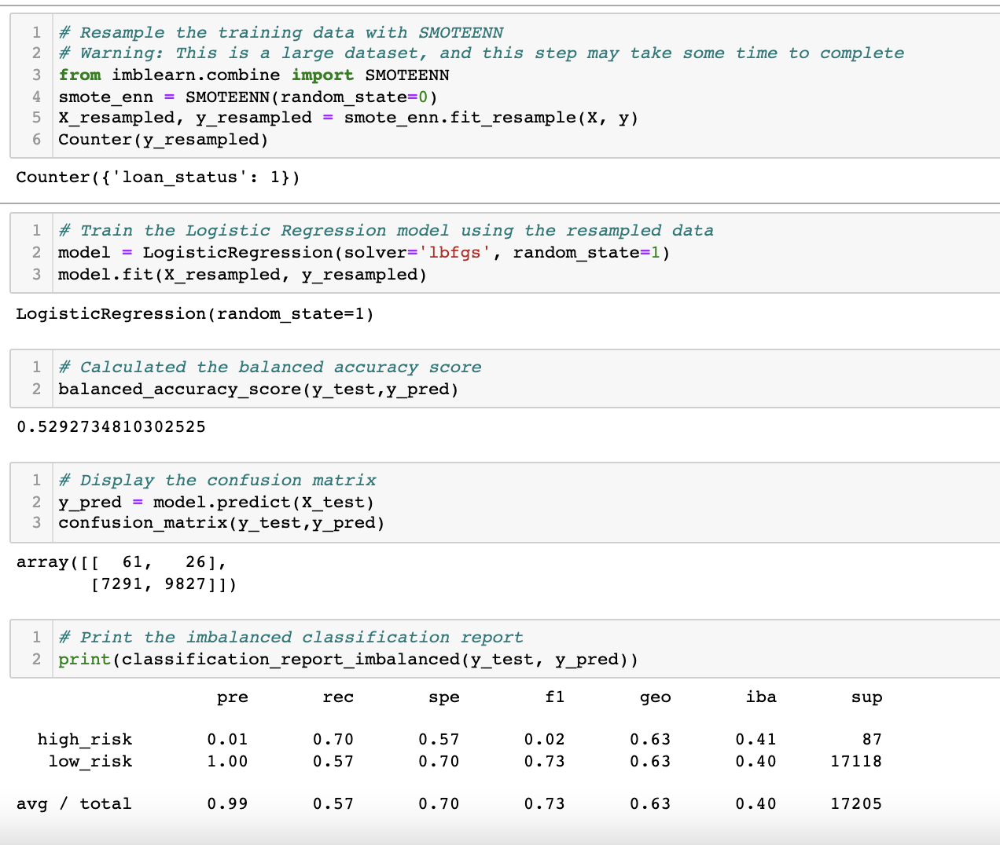
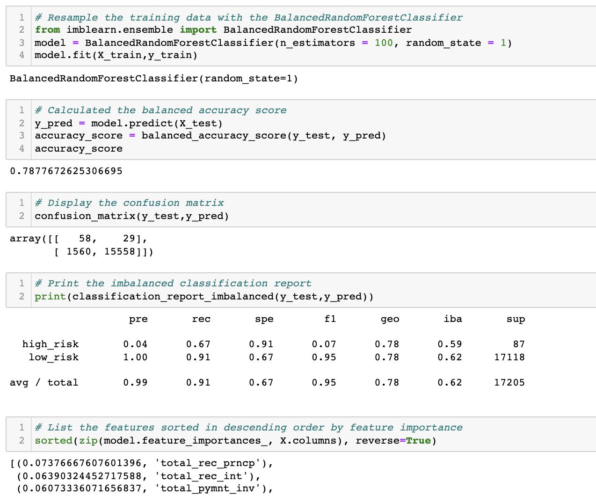
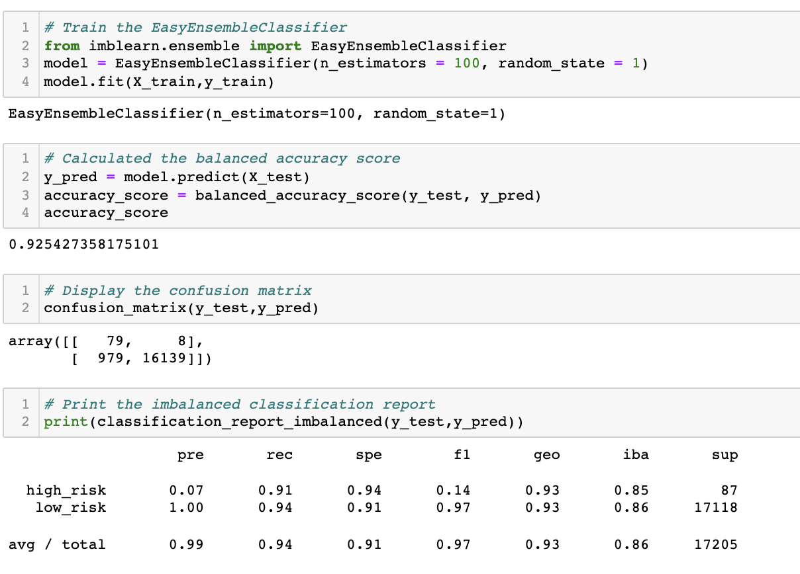

# Credit_Risk_Analysis

## Overview of the analysis
Using imbalanced-learn and scikit-learn libraries to build and evaluate models using resampling to predict credit risk. 

## Results

### •	Oversampling the data using the RandomOverSampler and SMOTE algorithms.

### * Smote algorithm.

### •	Undersampling the data using the ClusterCentroids algorithm. 

### •	Combinatorial approach of over- and undersampling using the SMOTEENN algorithm

### •	Compare two new machine learning models that reduce bias, BalancedRandomForestClassifier and EasyEnsembleClassifier

## Summary
Analysis shows that majority of the models have low balanced accuracy score. 
Easy Ensemble AdaBoost model shows better accuracy. Also, the precision for the high-risk profile is low, thus they have issue to detect risk. Therefore, financial institutions may combine these models with other analysis. 

